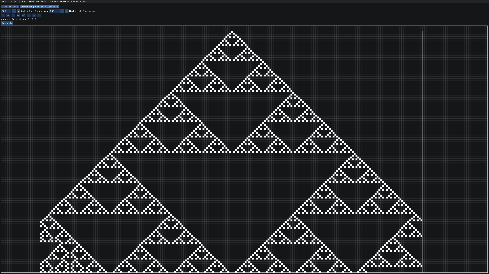

# The_Cellular_Automata

This is a generator for Elementary Cellular Automata and John Conway's Game of Life.
Inspired by Stephen Wolfram's 2002 book: [A New Kind of Science](https://www.wolframscience.com/nks/).




## John Conway's Game of Life

- The universe of the Game of Life is an infinite, two-dimensional orthogonal grid of square cells, each of which is in one of two possible states, alive or dead.
- Every cell interacts with its eight neighbours, which are the cells that are horizontally, vertically, or diagonally adjacent.
- At each step in time, the following transitions occur:
  1. Any live cell with fewer than two live neighbours dies, as if by underpopulation
  2. Any live cell with two or three live neighbours lives on to the next generation
  3. Any live cell with more than three live neighbours dies, as if by overpopulation
  4. Any dead cell with exactly three live neighbours becomes a live cell, as if by reproduction
- This creates complex patterns from very simple rules.
- There are three prederminated patterns included:
  1. [R-Pentomino](https://www.conwaylife.com/wiki/R-pentomino): A finite pattern with a predetermined lifespan.
  2. [Glider Gun](https://conwaylife.com/wiki/Gosper_glider_gun): A finite pattern with unbounded growth.
  3. [Infinite Growth](https://www.conwaylife.com/wiki/Infinite_growth): A one cell thick infinite growth pattern.

## Elementary Cellular Automata

- Elementary Cellular Automata are the simplest class of one-dimensional cellular atomata.
- Each cell in a grid has two possible values (0 or 1) and rules that depend on their previous three nearest neighbours.
- In this program, different automata can be generated simply by changing an 8-bit binary number that represents the rules for what each cell's state should be given it's neighbours.
- More details at [Wolfram Mathworld](https://mathworld.wolfram.com/ElementaryCellularAutomaton.html).

## **About the Project**

- This is my first attempt at a non-trivial project with zero influence from a tutorial. Please enjoy :)

## ***Project Setup***

User must have [the Meson build system](https://mesonbuild.com/) installed before the project can be built. Project is self-contained and easily builds on Linux, but GLEW must be installed linked separately on Windows due to an [issue with how Meson invokes the Microsoft Resource Compiler](https://github.com/ocornut/imgui) for the GLEW library. This can be done using [vcpkg](https://vcpkg.io/en/index.html) or your package manager of choice.

Dependencies:

- [GLFW3](https://www.glfw.org/)
- [GLEW](https://github.com/nigels-com/glew)
- [OpenGL](https://www.opengl.org/)
- [DearImGui](https://github.com/ocornut/imgui)

```bash
# Navigate to the desired directory, then run the following command
$ git clone --recursive https://github.com/Karsteski/The_Cellular_Automata.git
$ cd builddir
$ meson configure -Dcpp_std=c++17
$ meson configure -Dbuildtype=release
$ meson compile
$ ./cellular-automata-generator
```

### Things I would have done differently

- Use `std::vector` instead of `std::map`. This would result in significantly faster iteration (O(n) instead of O(log(n)).
- Write unit tests while writing the program. At the time I was in a hurry to get something working, and therefore I thought unit testing would have slowed me down. BIG MISTAKE. It would have certainly helped fix bugs far faster.
- Stick to STL containers. `ImVec2` was used to store point information but ultimately it would have been simpler to stick to `std::pair` or `std::tuple`.
